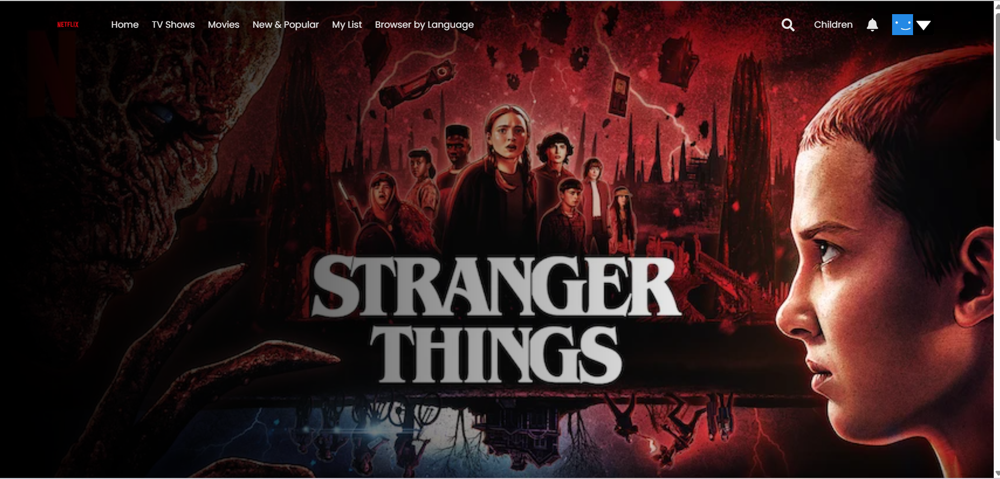
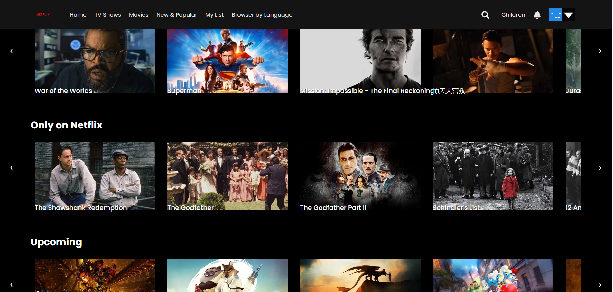
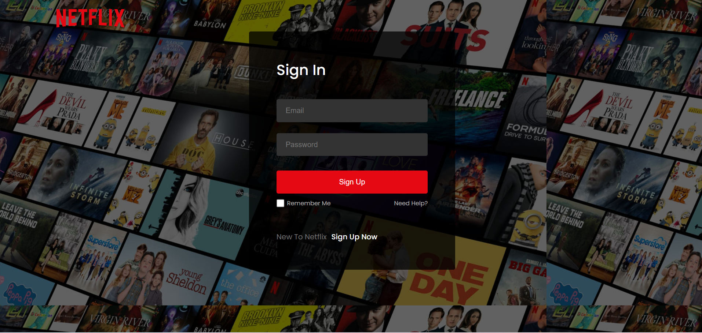
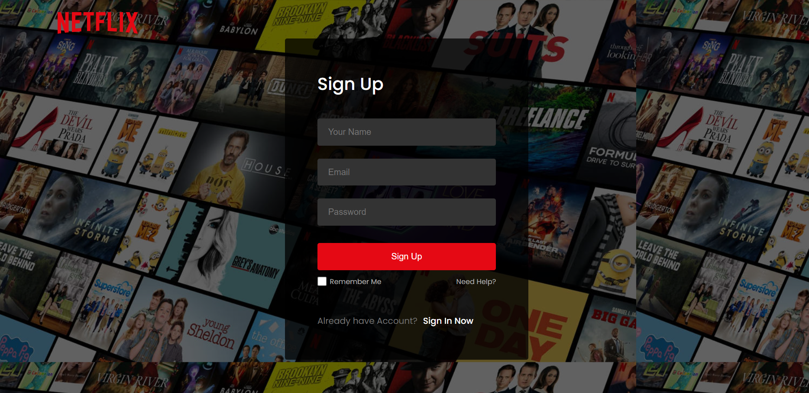

# 🎬 Netflix Clone (React + Firebase)

A Netflix-inspired web app built with React that includes **authentication, dynamic movie cards, and trailer playback**.  

---

## 🚀 Features
- 🔐 **Authentication**: Login, Sign Up, Sign Out using Firebase Authentication.  
- 🎞️ **Movie Cards**: Browse popular, trending, and upcoming movies.  
- ▶️ **Trailers on Click**: Clicking a card opens the movie trailer.  
- 📱 **Responsive Design**: Works smoothly on desktop and mobile.  
- 🌐 **Deployed on**: Netlify
- [Live](https://saloni06.netlify.app)

---

## 🛠️ Tech Stack
- **Frontend**: React, CSS  
- **API**: TMDB API (for movie data & trailers)  
- **Icons**: React Icons  

---

## 📸 Screenshots  

### 🏠 Homepage

### 🔑 Login Page

